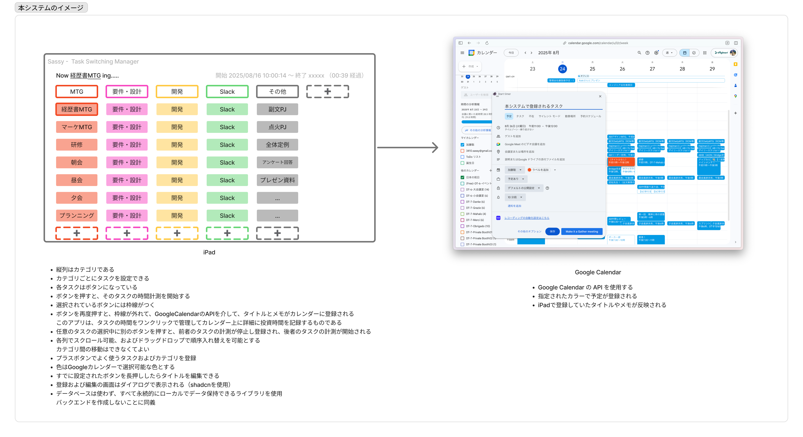

# Sassy Task Switch Logger - Task Switching & Time Logging App



## 1. 概要 (Overview)

このプロジェクトは、個人の業務におけるタスクの切り替えコストを正確に計測し、その投資時間をGoogle Calendarにシームレスに記録するためのiPad向けアプリケーションです。ワンクリックでタスクの時間計測を開始・停止・切り替えでき、計測の煩雑さを解消することを目的とします。

## 2. 背景 (Background)

類似サービスとしてToggl Trackがありますが、Google Calendarへのイベント自動作成機能がありません。本アプリは、タスクに費やした時間を正確に計測し、その実績を直接Google Calendarに反映させることで、日々の振り返りや生産性分析を容易にすることを目指します。

- **ターゲットユーザー**: 開発者本人 (個人利用)
- **ターゲットデバイス**: iPad Air 11-inch (M3), 横画面での使用を想定

## 3. 主要機能 (Key Features)

### 3.1. タスク管理
- **カテゴリ分類**: タスクを複数のカテゴリ（例: MTG, 開発, Slack）に分けて管理します。カテゴリは縦の列として表示されます。
- **タスクのCRUD**:
    - **作成**: 各カテゴリに頻繁に行うタスクをボタンとして登録できます。
    - **読込**: アプリ起動時に登録済みのタスクとカテゴリをローカルから読み込みます。
    - **更新**: 既存のタスクボタンを長押しすることで、タイトルを編集できます。
    - **削除**: タスクを削除する機能。
- **UI/UX**:
    - 各カテゴリ列は独立して縦方向にスクロール可能です。
    - 同じカテゴリ内であれば、タスクボタンをドラッグ＆ドロップで並び替えできます。

### 3.2. 時間計測
- **ワンクリック操作**:
    - タスクボタンをタップすると、そのタスクの時間計測を開始します。
    - 計測中のタスクは、ボタンに枠線が表示され、視覚的に識別できます。
    - 再度同じボタンをタップすると、計測が停止し、その記録がGoogle Calendarに登録されます。
- **タスクスイッチング**:
    - あるタスクを計測中に別のタスクボタンをタップすると、前のタスクの計測が自動で停止・登録され、新しいタスクの計測がシームレスに開始されます。
- **ステータス表示**: 画面上部に、現在実行中のタスク名、開始時刻、経過時間を表示します。

### 3.3. Google Calendar 連携
- Google Calendar APIを利用して、ユーザーのGoogleアカウントと連携します。
- 計測が完了したタスクは、以下の情報を含むイベントとして自動でカレンダーに登録されます。
    - **タイトル**: タスク名
    - **開始時刻 / 終了時刻**: 計測された時間
    - **色**: アプリ内でタスクに設定した色（Google Calendarのイベントカラーパレットと対応）
    - **説明 (メモ)**: （任意）タスクに関するメモを登録できる

### 3.4. データ永続化
- **バックエンド不要**: サーバーやデータベースは構築しません。
- **ローカル保存**: タスクやカテゴリのデータは、すべてデバイスのローカルストレージに永続的に保存します。

## 4. 画面仕様 (Screen Specifications)

### 4.1. メイン画面 (Task Grid View)
- **ヘッダー**: 現在計測中のタスク情報（タスク名、経過時間など）を表示。
- **ボディ**:
    - カテゴリを列、タスクを行とするグリッド（マトリックス）レイアウト。
    - 各セルはタスクボタン。
    - 各列の最下部に、新しいタスクを追加するための「+」ボタンを配置。
    - グリッドの末尾に、新しいカテゴリを追加するための「+」列を配置。

### 4.2. タスク/カテゴリ追加・編集ダイアログ
- タスクやカテゴリの「+」ボタンを押した際、またはタスクの長押し時に表示されるモーダルダイアログ。
- UIコンポーネントは`shadcn`のスタイルを参考に、モダンでクリーンなデザインとします。
- タスク名、カテゴリ名の入力に加えて、色の選択が可能です。
- **色の選択UIは、Google Calendar APIの `colors` エンドポイントから取得したイベントカラーの一覧を表示し、ユーザーが選択できるようにしてください。**

## 5. 技術要件 (Technical Requirements)

- **プラットフォーム**: React Native (Expo)
- **言語**: TypeScript
- **状態管理**: **Zustand** を使用してください。
- **UIライブラリ**:
    - `shadcn-ui/react-native` や `tamagui` など、shadcn風のコンポーネントが利用できるもの。
    - ドラッグ＆ドロップ機能のために `react-native-gesture-handler` と `react-native-reanimated` を使用。
- **データ永続化**: `react-native-mmkv` または Expo標準の `expo-secure-store` / `expo-file-system` を使用。
- **外部API**:
    - Google Calendar API
    - 認証には `expo-auth-session` を使用してGoogle OAuth 2.0フローを実装。

## 6. 実装要件 (Implementation Details)

### 6.1. 環境変数 (Environment Variables)
プロジェクトのルートに `.env` ファイルを作成し、以下の変数を定義してください。これらはGoogle Cloud Platform (GCP) でOAuth 2.0 クライアント IDを作成することで取得できます。

```
# .env
GOOGLE_OAUTH_IOS_CLIENT_ID="YOUR_IOS_CLIENT_ID_HERE"
GOOGLE_OAUTH_WEB_CLIENT_ID="YOUR_WEB_CLIENT_ID_HERE" # Expo Goでのデバッグ用
```

### 6.2. データ構造
カテゴリとタスクのデータモデルを定義してください。

```typescript
interface Category {
  id: string;
  name: string;
  order: number;
}

interface Task {
  id: string;
  name: string;
  categoryId: string;
  colorId: string; // Google CalendarのColor ID (例: '1' から '11')
  order: number;
}
```

### 6.3. 状態管理
アプリ全体のグローバルな状態（現在計測中のタスク、タスクリスト、カテゴリリストなど）は**Zustand**を用いて管理してください。これにより、コンポーネント間の状態の受け渡しがシンプルになります。

### 6.4. UI実装
- 添付画像を元に、グリッドレイアウトを実装してください。各カテゴリ列は`ScrollView`でラップしてください。
- **アニメーション**:
    - **タスクを選択した際の枠線の表示は、フェードイン/アウトのような滑らかで自然なアニメーションにしてください。**
    - **タスクボタンのドラッグ＆ドロップによる並び替えも、`react-native-reanimated` を活用して滑らかに動作するようにしてください。**

### 6.5. 時間計測ロジック
- 現在計測中のタスク情報（`taskId`, `startTime`など）をZustandストアで管理してください。
- タスクボタンがタップされた際の処理フローを実装してください（計測開始・停止・スイッチング）。

### 6.6. Google Calendar API連携
- 認証フロー、アクセストークンの管理、イベント作成関数の実装を行ってください。
- トークンの有効期限が切れた場合に、リフレッシュトークンを用いて自動で更新する処理も実装してください。

### 6.7. エラーハンドリング
- Google Calendar APIへのリクエストが失敗した場合（オフラインなど）、ユーザーに通知してください。
- (発展) 登録に失敗したイベント情報をキューとしてローカルに保存し、オンライン復帰時に再送信する機能を検討してください。

## 7. 開発ステップ (Development Steps)

このアプリの開発は、以下の3ステップで進めてください。

1.  **Step 1: UIの静的実装**
    - まず、モックデータを使用して、ヘッダー、グリッドレイアウト、タスクボタン、ダイアログなどのUIコンポーネントを静的に実装してください。この段階では、機能ロジックは不要です。

2.  **Step 2: ローカル機能の実装**
    - 次に、UIに機能を統合します。Zustandによる状態管理、タスクのCRUD操作、ローカルストレージへのデータ永続化、そしてワンクリックでの時間計測ロジックを実装してください。

3.  **Step 3: Google API連携の実装**
    - 最後に、Googleとの連携機能を実装します。`expo-auth-session` を用いたOAuth認証フローを構築し、時間計測が完了したタスクをGoogle Calendarにイベントとして登録する処理を実装してください。

# 備考

AI Studio リンク

https://aistudio.google.com/app/prompts?state=%7B%22ids%22:%5B%2216tNeZYCaKzrlpETgB36JeKF8Ev_AWzGv%22%5D,%22action%22:%22open%22,%22userId%22:%22111016859535607470631%22,%22resourceKeys%22:%7B%7D%7D&usp=sharing

https://drive.google.com/file/d/1BMLgdwt54b1OO4AVWnuQQ2qz1NHRd8Hy/view?usp=sharing
